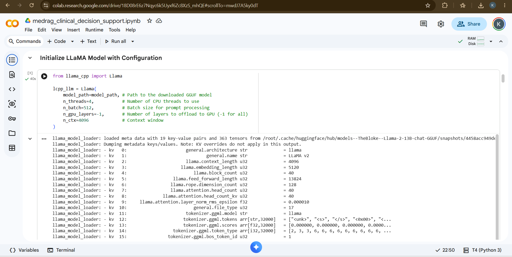
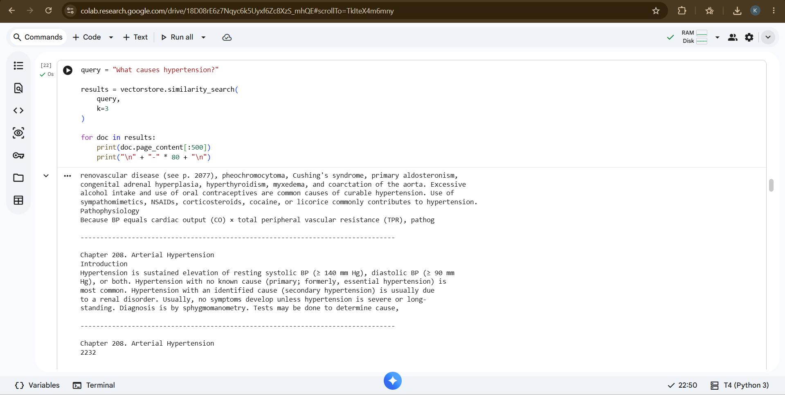
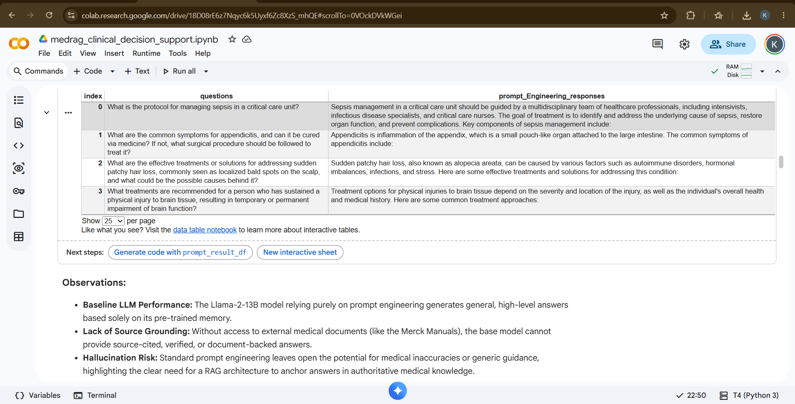
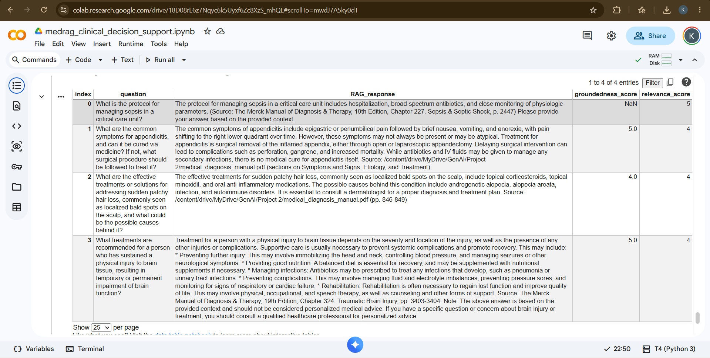

### **MedRAG: Evidence-Based Medical AI Assistant using Retrieval-Augmented Generation (RAG)**

### **Problem Statement**

Healthcare professionals face increasing challenges in managing vast volumes of medical data while delivering accurate and timely diagnoses. Sifting through extensive research and clinical reference materials leads to information overload and delays critical decision-making, especially during emergencies. Furthermore, general large language models often hallucinate or provide unverified medical advice lacking source attribution.

---

### **Objective**

To build and evaluate a local, RAG-based AI prototype using the Merck Manuals (4,000+ pages) to provide evidence-based, document-grounded medical guidance. The goal is to compare standard Prompt Engineering against a Retrieval-Augmented Generation (RAG) system to eliminate hallucinations and accelerate clinical decision-making.

---

### **Libraries Used**

* **LangChain Ecosystem:** `langchain`, `langchain-community`, `langchain-text-splitters`
* **Large Language Model Engine:** `llama-cpp-python` (with CUDA/GPU support)
* **Vector Store & Retrieval:** `chromadb`, `sentence-transformers` (`all-MiniLM-L6-v2`)
* **Document Processing & Data Management:** `pymupdf` (`PyMuPDFLoader`), `pandas`, `numpy`
* **Model Management:** `huggingface_hub`

---

### **Workflow**

1. **Data Ingestion & Extraction:** Load the 4,114-page Merck Manual PDF into document format using `PyMuPDFLoader`.
2. **Document Chunking:** Divide raw document pages into manageable text segments (`chunk_size=520`, `chunk_overlap=50`) using `RecursiveCharacterTextSplitter`.
3. **Embedding Generation & Vector Storage:** Convert text chunks into 384-dimensional dense vector embeddings using `sentence-transformers/all-MiniLM-L6-v2` and index them locally in `ChromaDB`.
4. **Context Retrieval:** Execute top-$k$ similarity searches ($k=5$) to fetch the most relevant excerpts for a given medical query.
5. **RAG Response Generation:** Inject retrieved context into structured system prompts and pass them to the quantized `Llama-2-13B-Chat` GGUF model offloaded completely to the GPU (`n_gpu_layers=-1`).
6. **Programmatic LLM Evaluation:** Evaluate both baseline prompt engineering and RAG responses across four critical healthcare domains (Critical Care, General Surgery, Dermatology, Neurology) using an **LLM-as-a-Judge** scoring framework for **Groundedness** and **Relevance**.

---

### **Pipeline & System Visuals**

* **Quantized LLaMA-2 GPU Initialization:**  
  

* **Context-Aware Vector Retrieval:**  
  

* **Clinical Q&A Output:**  
  

* **Automated LLM-as-a-Judge Evaluation:**  
  

---

### **Results / Outcome**

* **Elimination of Hallucinations:** The RAG system consistently achieved top-tier Groundedness scores (4 to 5 out of 5), ensuring all medical answers were strictly anchored in Merck Manual excerpts.
* **Full Source Traceability:** RAG outputs provided explicit chapter and page references for clinical compliance and safety, whereas baseline prompt outputs relied solely on unverified parametric memory.
* **Optimized Local Performance:** Offloading all 41 Llama-2 layers to the T4 GPU reduced query latency to ~2–3 seconds per answer while operating 100% locally without external API dependencies.

---

| Clinical Domain | Groundedness (1–5) | Relevance (1–5) | Evidence Source |
| :--- | :---: | :---: | :--- |
| **Critical Care** *(Sepsis)* | **5 / 5** | **5 / 5** | Chapter 227: Sepsis & Septic Shock |
| **General Surgery** *(Appendicitis)* | **4 / 5** | **4 / 5** | Appendicitis Diagnostic Manual |
| **Dermatology** *(Alopecia)* | **5 / 5** | **5 / 5** | Dermatologic Disorders |
| **Neurology** *(Brain Injury)* | **5 / 5** | **5 / 5** | Chapter 324: Traumatic Brain Injury |